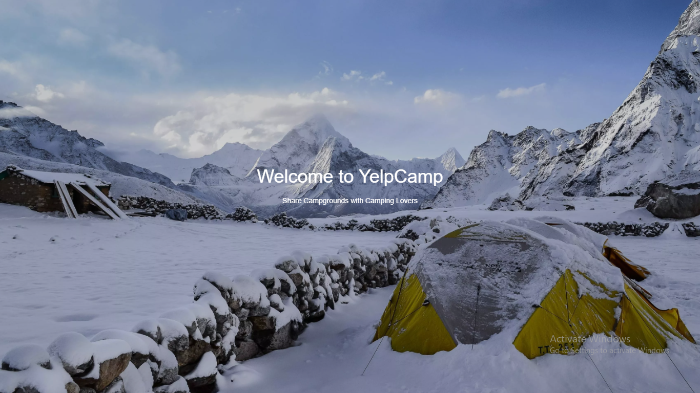
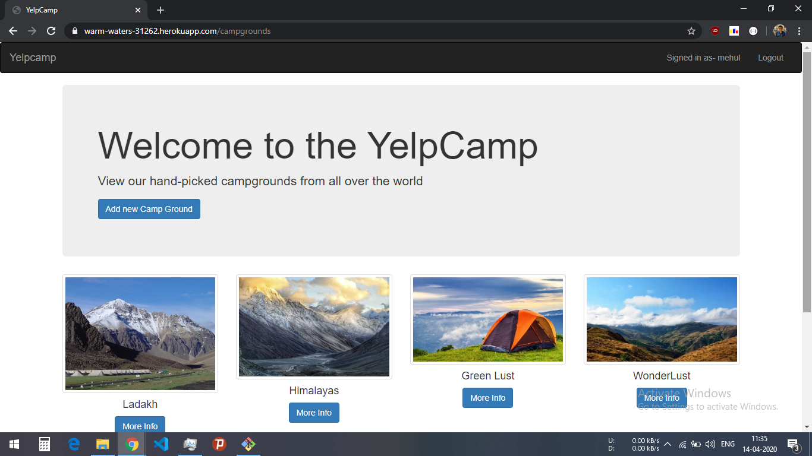
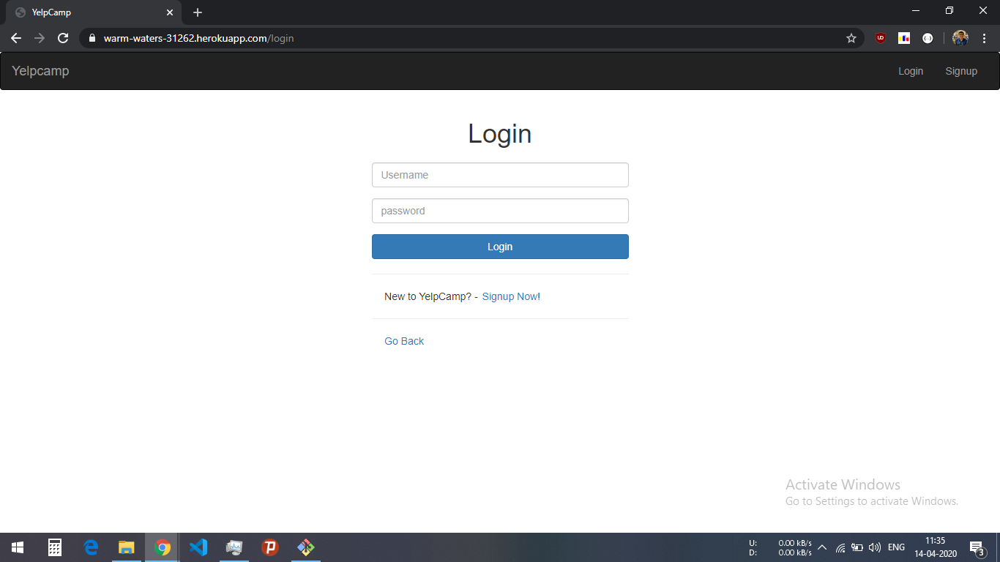
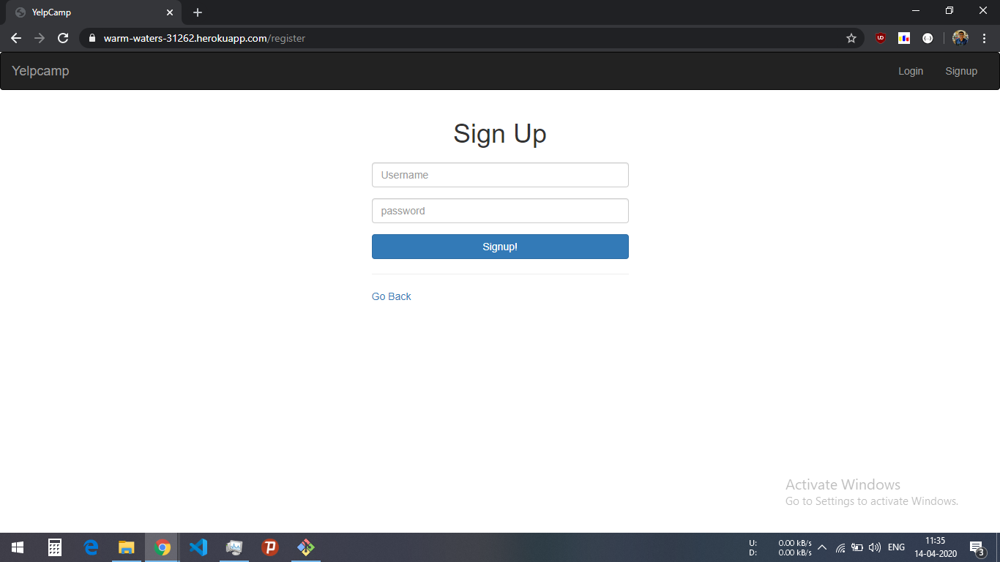
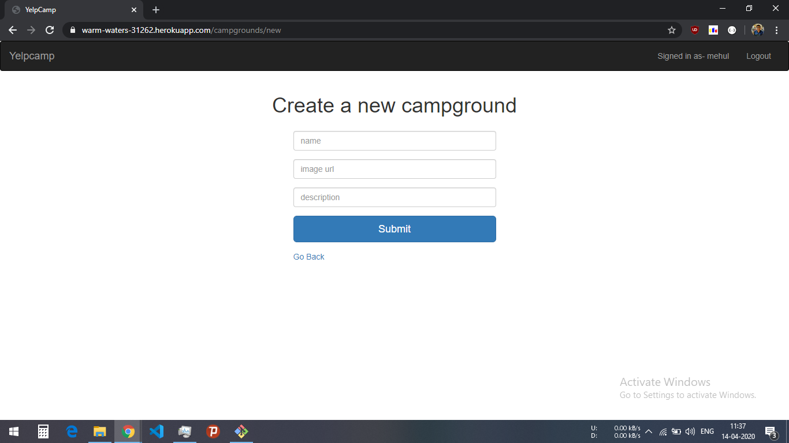
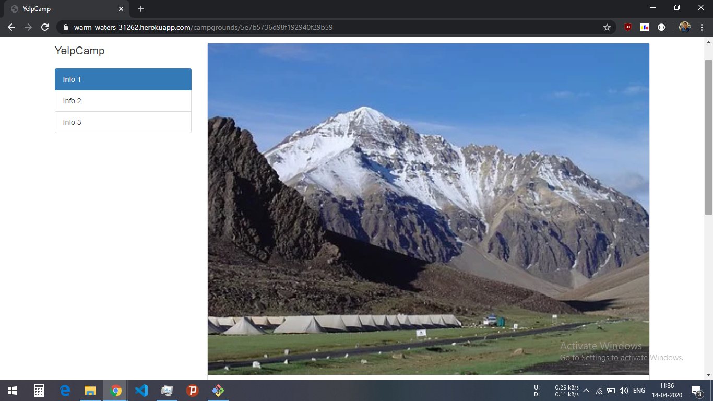
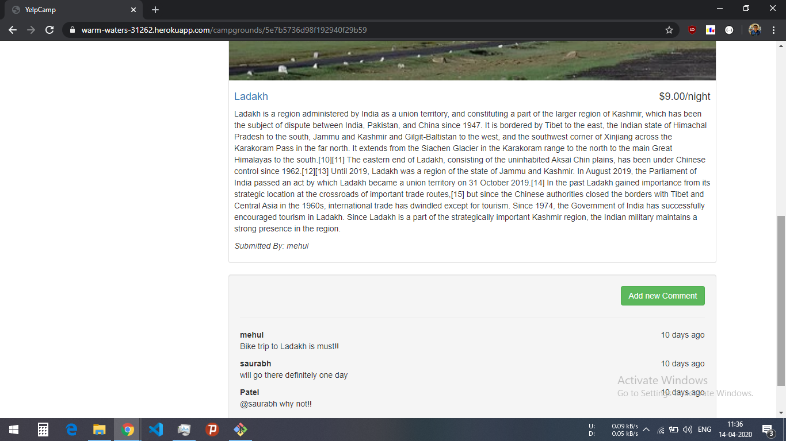

his is a website built on MongoDB,NodeJs,Express with HTML,Jquery,CSS and Bootstrap 3.7. To see this website either go through the link https://warm-waters-31262.herokuapp.com/ or just download or clone this repository and run the local server on port 8000 after installing npm by using command "npm i".

Here are some screenshots of this website :

